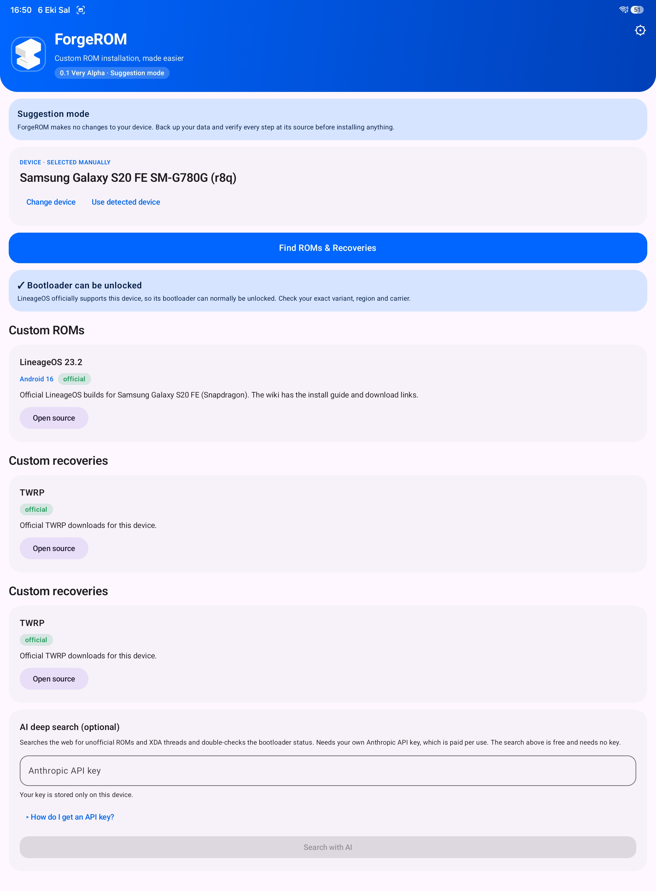
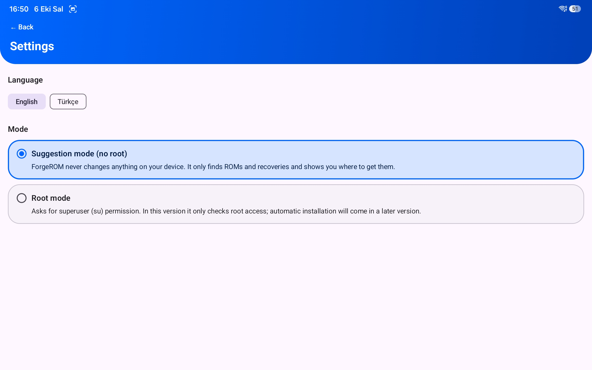

# ForgeROM

Custom ROM hub for Android devices

## Features

- Translatable Strings
- Built on SDK-8 (Android 8)
- Most of development is making by Claude Sonnet 5.5
- Auto model detection and manuel selector
- AI Built-in (needs API key) suggestor and helper (There is a free alternative)
- Root mode for auto installing
- Light/Dark Mode (coming soon)

## Screenshots

## Installation

Installation is easy, this project is already builded by GitHub Actions.

1. Download latest.apk from Releases
2. Install the app-debug.apk file
3. If any security problem appears (like Google Play), continue anyway. This is an %100 open source and safe project. The reason it is issuing warnings is that I haven't made the necessary adjustments yet.

    
## License

This project is protected by the GNU General Public License!

## Support and Author

- Made idea by me, Galaxy Expert (Muratcan Yücepur)
- Report all issues to GitHub or XDA, also you can do pull requests.
